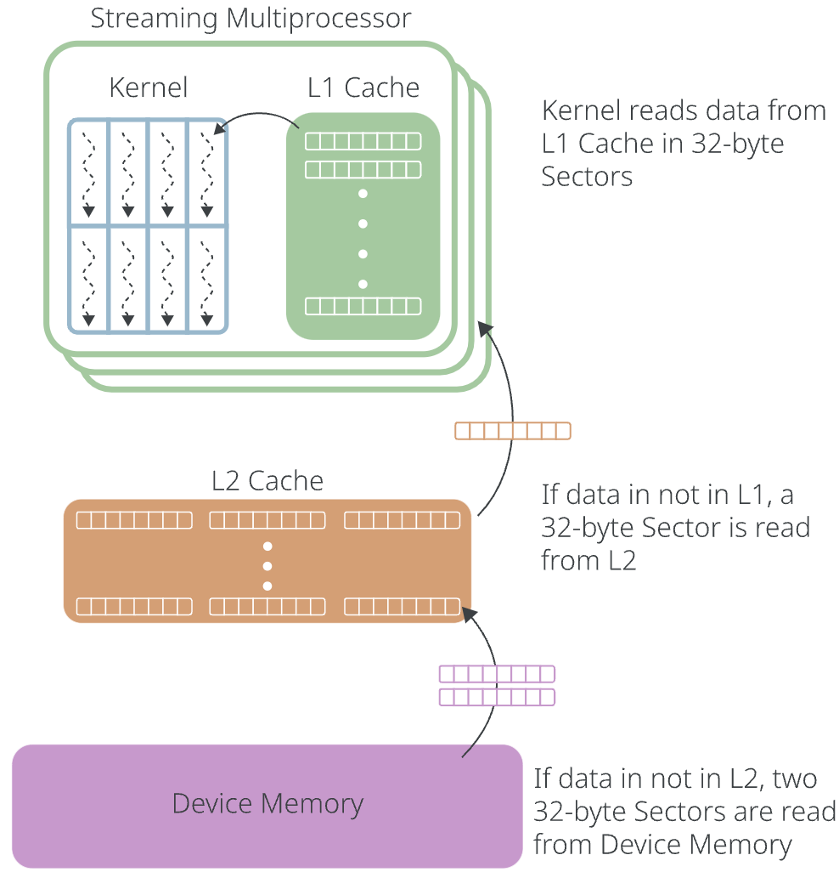

# cuda memory

> copied from https://tinkerd.net/blog/machine-learning/cuda-basics/#global-memory

## 全局内存

当我们使用在 GPU 上分配内存时cudaMalloc，该空间被分配在全局内存中，这是我们的 CUDA 内核可用的最大和最慢的内存类型。

全局内存是一个逻辑内存空间，其物理后盾是一级缓存、二级缓存和设备内存。当内核从全局内存读取数据时，实际数据可以从这三个物理内存空间中的任意一个获取。

L1 缓存是一个小型、快速且私有的缓存，位于每个流多处理器本地。当线程从全局内存请求数据时，首先检查 L1 缓存；如果 L1 缓存中未找到数据，则向 L2 缓存发出读取请求（这称为L2 缓存未命中）；同样，如果 L2 缓存中也未找到数据，则向设备内存发出读取请求（这称为设备内存缓存未命中）。

CUDA 内核线程从全局内存中以 32 字节块（称为“扇区”）读取数据：




## 本地内存和寄存器

除了 GPU 上所有流多处理器都可以访问的全局内存之外，每个单独的线程还可以访问自己的私有寄存器和本地内存。

虽然寄存器和本地内存都是每个线程私有的，但它们的物理位置（以及访问速度）却截然不同。寄存器是 GPU 上速度最快的内存类型；通常，CUDA 内核中声明的任何标量类型变量（整数、浮点数等）都将存储在寄存器中。

每个线程和 SM 上可分配的寄存器数量是有限制的（例如，在 A100 GPU 上，每个线程的最大寄存器数量为 255）。

无法存储在寄存器中的局部变量（可能是因为寄存器数量已用尽，或者因为变量是一个数组，其元素在运行时动态访问）将存储在本地内存中。本地内存存储在与全局内存相同的物理位置，因此访问时会产生与全局内存相同的延迟损失。

## 共享内存 

CUDA 内存层次结构中的第三个逻辑内存空间是共享内存。这是一个小型、快速的内存空间，由线程块中的所有线程共享。物理上，共享内存通常存储在与前面讨论过的 L1 缓存相同的位置。

甚至可以（在一定程度上）通过在运行时设置属性来配置专用于共享内存cudaFuncAttributePreferredSharedMemoryCarveout的 L1 缓存/共享内存空间的比例：

```
cudaFuncSetAttribute(
    my_kernel,
    cudaFuncAttributePreferredSharedMemoryCarveout,
    20 // Use 20% of combined L1/Shared Memory for Shared Memory
);
my_kernel<<<num_blocks, num_threads>>>();
```

要在共享内存中分配空间，我们在 CUDA 内核中声明变量时使用__shared__关键字。共享内存对于存储需要由线程块中的多个线程访问的数据非常有用。

到目前为止，我们编写的所有示例内核都假设每个线程完全独​​立于其他线程执行；但为了有效地使用共享内存，我们需要一种方法来同步不同线程的执行（例如，我们可以保证一个线程在另一个线程读取共享内存之前已经完成写入共享内存）。

## 线程同步 

可以使用__syncthreads()函数同步同一线程块中的线程。当一个线程到达__syncthreads()调用时，它将暂停执行，直到线程块中的所有其他线程也到达同一点。

demo参考[softmax.cu](softmax.cu)


