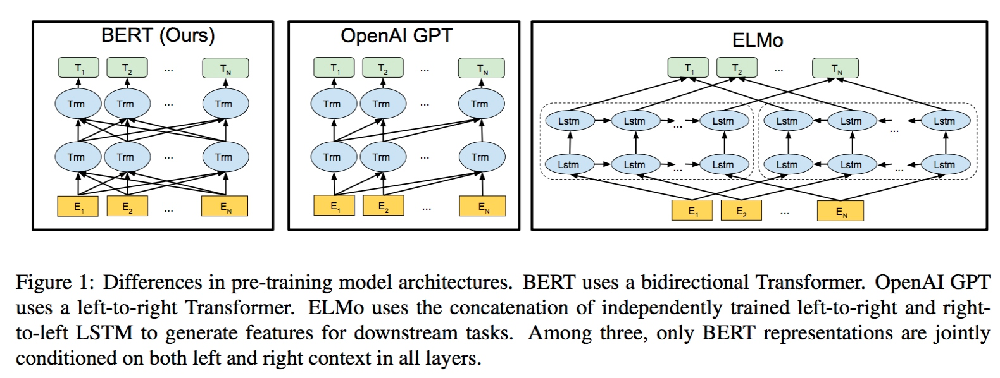
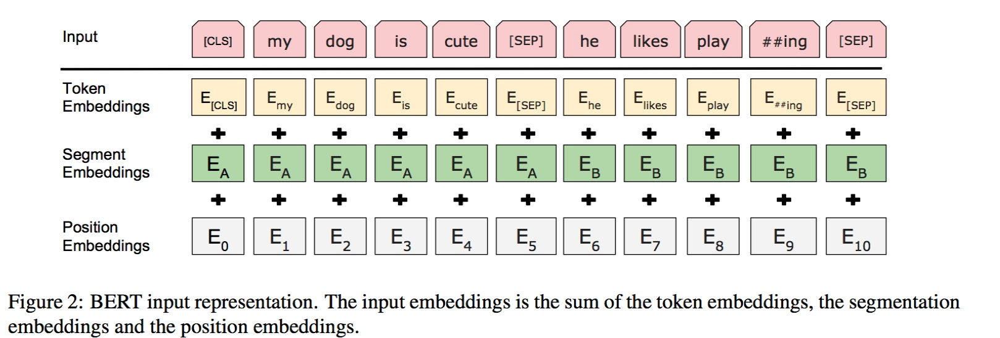
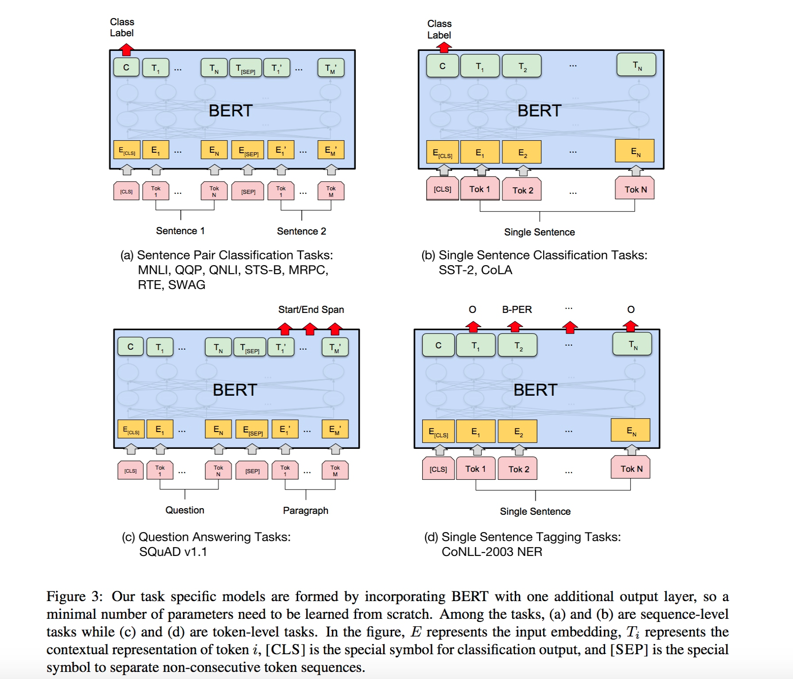

# Bert

Copy from https://shangzhi-huang.gitbook.io/workspace/nlp-zhi-yu-yan-mo-xing/lun-wen-bert-pretraining-of-deep-bidirectional-transformers-for-language-understanding

# 1. 简介

近年来，预训练语言模型在NLP任务上发挥着越来越重要的作用，尤其是对于很多标记数据不足的场景。通过使用大量未标记的文本数据训练一个好的语言模型，再进行迁移学习通常会明显改善模型的表现。

从早期的神经网络语言模型，到Word2Vec，再到近年来RNN相关的语言模型ELMo，再带基于去年google发布的Transformer模型的语言模型OpenAI GPT。语言模型的种类很多，但是大致在应用上有两种方案：

第一种是feature-based的，例如ELMo，这种方案里预训练模型通常只是作为一个特征补充的方案，模型的结构还是得按照具体的任务来定。而另一种是fine-tuning的方式，例如OpenAI GPT，在这种方案里，模型的参数基本是与任务无关的，预训练做好后，针对特定的任务只要对模型进行微调就好了。在以前的方法里，这些预训练都是基于同样的损失函数: 序列的交叉熵损失，而且学到也都是单向的语言生成模型。

单向语言模型严重制约了预训练模型的表征能力，本文提出的BERT模型通过使用新的训练目标“Masked Language Model”(MLM)来解决单向语言模型的局限性。MLM将随机选择输入中的某些词作为masked词，然后基于其上下文来预测这个masked词。不像之前的从左到右的预训练模型，MLM允许我们融合左语境和右语境，来训练一个双向的深度Transformer模型。除此之外，本文还引入了另外一个简单的预测任务来预测两个句子是否匹配关系。

论文主要贡献为：
- 验证了双向预训练对于语言表征的重要性
- 展示了预训练可以减轻很多繁重的基于特定任务结构设计问题。BERT是首个在sentence级别和token级别都刷新SOTA成绩的基于fine-tuning的表征模型
- BERT刷新了11项NLP任务记录。模型的双向特征是BERT最重要的一个贡献

# 2. 相关工作

Feature-based方法，Fine-tuning方法，利用标记数据进行迁移学习

通常来说，无监督预训练的一大好处是数据量的充足，就那NLP来说，纯文本内容例如用户评论简直是要多少有多少。但是对于有监督学习来说，很多研究表明一个好的无监督预训练然后再进行迁移学习同样可以提升有监督学习的模型表现。

# 3. Bert

## 3.1 模型结构

BERT模型是一个双向多层的TransformerEncoder模型，Transformer的介绍可以参考之前的文章，这里不详细介绍了。下面的结构中，L表示Transformer的层数，H表示隐藏层单元数，A表示多头self-attention的个数。然后所有的前向全联接的维度为4H。测试了两种模型大小的表现

- BERT_BASE (L=12, H=768, A=12, Total Parameters=110M)
- BERT_LARGE (L=24, H=1024, A=16, Total Parameters=340M)

## 3.2 输入表示

BERT模型既可以以单个句子为输入，也可以处理类似问答系统这样的两个句子的情形。对于一个token，它的输入表示为所有对应的token，segment，position的embedding之和，如下图：

具体而言：
- 使用了包括WordPiece的30000个token的词表。对于分开的word piece用##表示
- 支持最大长度为512token序列的位置embedding
- 每句话的第一个token都被置为[CLS], 是一个特殊的embedding。对于分类问题来说，这个token的embedding就作为序列整体的表示。对于非分类问题，这个embedding被忽略
- 句子对(eg: 问答任务)的两个句子被链接在一个序列中。两个句子的区分在于：首先用[SEP]分隔符将两句话分开，其次定义两个特殊的segment embedding，E[A]和E[B]，分别代表A句和B句的每个token
- 对于单句输入，只考虑句子A的embedding

## 3.3 预训练任务

不同于传统的训练单向语言模型的方法，BERT创新性地引入了两个训练任务

### 3.3.1 Task #1: Masked LM

为了训练一个双向的语言模型，BERT使用了一种不同的方法。类似于完形填空，BERT会随机遮住15%的词来预测这些词，所以是一种masked LM，需要预测的只是被mask的位置上的词，而不需要重现整个句子。

虽然这样做可以让我们得到一个双向的模型，但是也会有两个缺点。首先，我们将遮住的词替换为[Mask]，但是在实际fine-tuning的时候并没有这个token，这就导致预训练和fine-tunining不一致。因此，我们的做法是随机选择15%的token，例如对于my dog is hairy选择了hairy，进行如下操作：
* 80%的情况下将这个词替换为[Mask]
* 10%的情况将这个词替换为一个随机的词
* 10%的情况保持词不变，这个目的是使模型表示适当偏向当前观测值

因为这样的Transformer encoder并不知道具体会预测哪个值，也不知道被遮住的是哪个词，所以对于每个token，他会尽量学习其分布式的语义表示。又因为只有1.5%的token被随机替换，这样的噪声并不会对模型的语言理解能力造成大的影响。

另外一个缺点就是由于每个batch只有15%的token被训练了，模型收敛起来会比传统语言模型更慢。不过相对于BERT对于精度的提升，这点效率损失也可以接收，预训练通常也不需要经常进行。

### 3.3.2 Task #2: Next Sentence Prediction

许多基于对话问答（QA）或者自然语言推理（NLI）的任务都是基于两句话关系的理解基础上的，而上面的语言模型显然并不能很好的捕捉这种特性。因此这里引入了一个被称为“下一句预测”的简单分类任务，随机从语料中选择句子A和B，其中50%的情况B是A的下一句话。50%的情况B是语料中随机的一句话：

Input = [CLS] the man went to [MASK] store [SEP] he bought a gallon [MASK] milk [SEP]

Label = IsNext

Input = [CLS] the man [MASK] to the store [SEP] penguin [MASK] are flight ##less birds [SEP]

Label = NotNext

最后的预训练模型对于这个分类问题达到了97%-98%的准确率。尽管这个任务看上去很简单，但是后面可以看到它对QA和NLI任务起到了积极的作用。

## 3.4 Pre-training过程
使用了BooksCorpus和英文Wiki的语料。为了提取出长的序列，最好使用文档级别的语料而不是句子级别的语料。

然后为了获取训练数据，从语料中采样“两段”文本内容，代表“sentences”，虽然它比语言上定义的实际的句子要长很多或者短很多。第一句使用seg A的embedding，第二句使用seg B的embedding，50%的概率B是A的下一句话，50%的概率B是随机的一句话。两个句子拼接起来的长度小于512个token。得到了这样的数据后，对word piece的token按15%的概率选择进行mask的操作，然后对每个被选择的token按照上文讲的三种方式处理。

训练模型时的一些超参选择如下：
* batch_size 256(256 * 512 = 128000 tokens/batch)
* 共1000000step，40个epoch
* adam，β1=0.9，β2=0.999
* L2正则系数0.01
* 学习率前10000个step不变，后面线性减小
* dropout 0.1
* 激活函数使用gelu

## 3.5 Fine-tuning过程

对于句子分类任务的fine-tuning，做法很简单，就是在前面提到的模型第一个特殊标志符[CLS]的输出上加一层softmax，将H维度映射到K，K表示分类任务的预测类的个数。span-level和token-level的fine-tuning略有不同，在后面介绍具体任务的时候再提。

在fine-tuning过程中，官方给的超参数设置建议是：
* dropout保持0.1
* batch-size使用16，32
* adam学习率5e-5, 3e-5, 2e-5
* epoch 3，4

* 由于fine-tuning比较快，可以考虑搜索不同超参组合，获得最优值。

# 4 试验

Google利用预训练好的BERT模型一共在11个任务通过fine-tuning获得了SOTA的表现。这11个任务可以被归为4种类型，这里介绍一下BERT模型在每类上的微调方法。

## 4.1 Sentence粒度 - Pair/Single Sentence分类

Pair和Single分别对应了上图的a和b，这种任务的fine-tuning过程非常简单。在预训练的BERT的结构上，对第一个位置[CLS]token的输出添加一个softmax进行分类，也就是上只需要额外增加一个全联接上的K*H个参数，其中K对应分类的类别。
论文中还提到了一些细节，Google使用了32的batch size训练了3个epoch。并且分别使用了5e-5，4e-5，3e-5，2e-5的初始fine tuning学习率，并且选择了在dev上最优的试验表现作为最终结果。除此之外，google提到large版本的BERT对于小样本集的fine-tuning并不稳定，因此google做了多次不同的随机初始化，选择了在dev上获得最优fine-tuning结果的模型作为最终模型。

4.2 SQuAD

对应着图中的任务c，虽然输出问答Task，但是这个任务并不属于生成式模型的范畴。对于给定的问题，解答是给定段落中截取的部分原文：

虽然和上面的分类问题很不一样，但是BERT仍然可以解决这个问题。Google的做法是将问题和段落合并在一起，按照训练时的方式，利用[SEP]和A／B的token embedding将它们分开。然后模型需要新增的参数是一个START向量和END向量。然后要做的就是预测在所有token中哪个是START，哪个是END。 对于每个token最终一层的输出，它是START的概率为：
而概率最大的token就是START。预测END的情况类似，训练的目标函数是两者的对数似然值。
